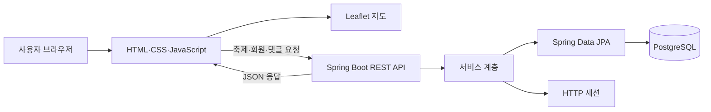
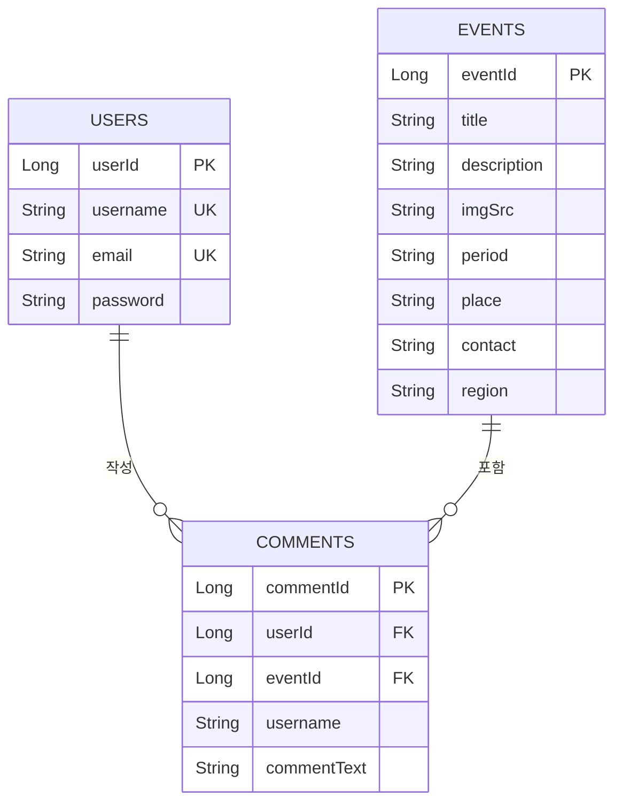
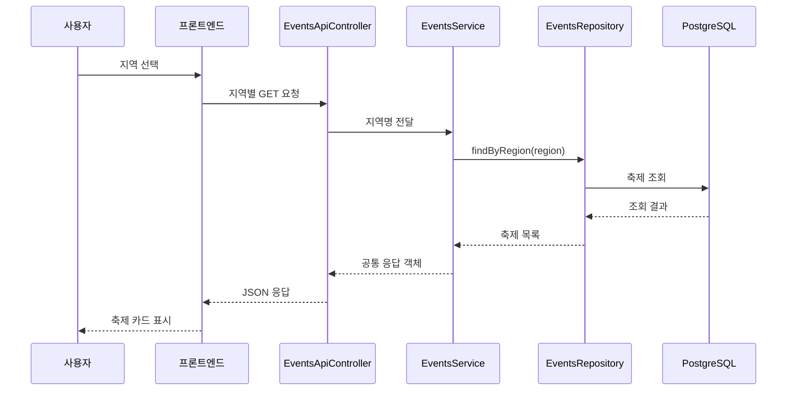
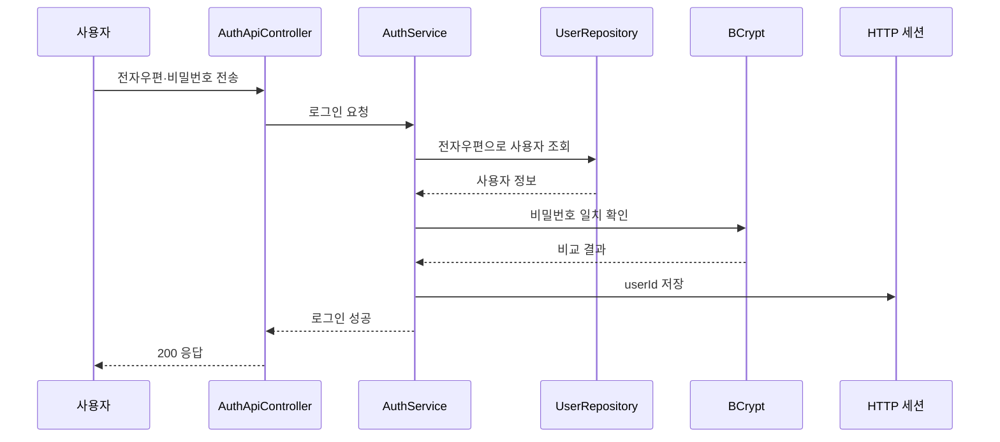
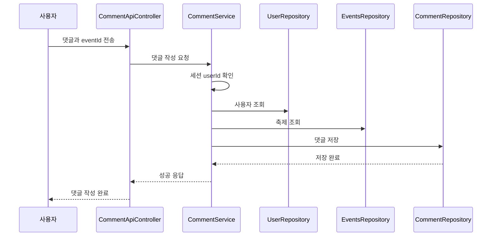

<div align="center">

# 지역축제를 찾아줘

### 지역축제 정보를 한곳에 모아 지역 방문과 지역경제 활성화를 돕는 웹 서비스

<br>


<br>

**Team RUN · 2024 금정구 해커톤 프로젝트**

</div>

---

## 1. 프로젝트 소개

수도권으로 인구와 생활 기반이 집중되면서 여러 지역이 인구 감소와 지역경제 침체 문제를 겪고 있습니다.

**지역축제를 찾아줘**는 여러 사이트와 사회관계망 서비스에 흩어져 있는 지역축제 정보를 한곳에 모아 보여주는 웹 서비스입니다. 사용자는 다가오는 축제를 확인하고, 지도나 지역 선택 기능을 통해 지역별 축제를 탐색하며, 로그인 후 축제에 대한 댓글을 작성할 수 있습니다.

단순한 축제 목록 제공을 넘어 다음과 같은 목적을 가지고 제작했습니다.

- 지역축제 정보 접근성 향상
- 사용자의 지역 방문 관심 유도
- 지역별 문화·관광 자원 홍보
- 지역축제 참여 확대
- 지역경제 활성화에 대한 관심 형성

---

## 2. 기획 배경

지역축제 정보는 지방자치단체 홈페이지, 관광 사이트, 블로그, 사회관계망 서비스 등 여러 공간에 나뉘어 있습니다.

사용자는 원하는 지역의 축제를 찾기 위해 여러 사이트를 반복해서 방문해야 하며, 축제의 위치·기간·상세 정보·사용자 반응을 한 번에 파악하기 어렵습니다.

이 문제를 해결하기 위해 다음과 같은 방향으로 서비스를 설계했습니다.

1. 다가오는 지역축제를 메인 화면에서 소개
2. 전국 지도를 활용해 대표 축제의 위치 제공
3. 지역 선택에 따라 해당 지역의 축제 목록 조회
4. 에디터가 선정한 대표 축제 추천
5. 축제별 상세 정보 제공
6. 로그인 사용자의 댓글 작성 및 조회
7. 지역축제 정보를 하나의 서비스에서 통합 제공

---

## 3. 핵심 기능

### 3.1 다가오는 축제 소개

메인 화면에서 가까운 시기에 열리는 지역축제를 카드 형태로 제공합니다.

- 축제명
- 대표 이미지
- 개최 기간
- 개최 장소
- 축제 설명
- 관련 링크
- 사회관계망 서비스 정보

사용자는 여러 사이트를 검색하지 않고도 주요 축제 정보를 빠르게 확인할 수 있습니다.

---

### 3.2 지역별 축제 조회

전국의 지역을 선택하면 해당 지역에 등록된 축제 목록을 조회합니다.

백엔드에서는 지역별 요청 경로를 제공하고, 각 요청을 지역명과 연결하여 데이터베이스에서 축제 정보를 조회합니다.

지원하도록 구성된 지역은 다음과 같습니다.

- 서울
- 부산
- 대구
- 인천
- 광주
- 대전
- 울산
- 세종
- 경기
- 강원
- 충북
- 충남
- 전북
- 전남
- 경북
- 경남
- 제주

---

### 3.3 지도 기반 축제 탐색

지도 화면에서 주요 지역축제를 마커로 확인할 수 있습니다.

- 대한민국 중심 좌표로 지도 초기화
- OpenStreetMap 지도 타일 사용
- 축제 위치에 Leaflet 마커 생성
- 마커 클릭 시 축제명 팝업 표시
- 지역별 대표 축제를 시각적으로 탐색

지도는 Leaflet 기반으로 동작하며, Folium에서 생성된 지도 구조를 정적 HTML에 연결하여 사용했습니다.

---

### 3.4 축제 상세 조회

축제 목록에서 특정 축제를 선택하면 축제 고유 번호를 기준으로 상세 정보를 조회합니다.

제공 정보는 다음과 같습니다.

- 축제 제목
- 축제 설명
- 이미지 경로
- 개최 기간
- 개최 장소
- 문의 정보
- 지역 정보
- 등록된 댓글

---

### 3.5 에디터 추천

에디터가 선정한 대표 지역축제를 별도 영역에서 소개합니다.

- 추천 축제 이미지
- 간단한 소개
- 개최 정보
- 상세 페이지 연결
- 외부 공식 페이지 연결

사용자가 평소 알지 못했던 지역축제를 발견할 수 있도록 구성했습니다.

---

### 3.6 회원가입·로그인·로그아웃

사용자 계정을 기반으로 댓글 기능을 제공합니다.

#### 회원가입

- 사용자 이름 입력
- 전자우편 주소 입력
- 비밀번호 입력
- 비밀번호 BCrypt 해시 변환
- 사용자 정보 데이터베이스 저장

#### 로그인

- 전자우편 주소로 사용자 조회
- 입력 비밀번호와 저장된 해시 비교
- 인증 성공 시 세션에 사용자 고유 번호 저장

#### 로그아웃

- 현재 세션 무효화
- 저장된 로그인 상태 제거

---

### 3.7 댓글 작성·조회·삭제

로그인한 사용자는 축제 상세 페이지에서 댓글을 작성할 수 있습니다.

- 현재 세션에서 사용자 고유 번호 확인
- 댓글 대상 축제 조회
- 사용자와 축제를 댓글 객체에 연결
- 댓글 데이터베이스 저장
- 축제 고유 번호를 기준으로 댓글 목록 조회
- 댓글 고유 번호를 기준으로 댓글 삭제

---

## 4. 기술 구성

### 4.1 전체 기술 스택

| 구분 | 사용 기술 | 적용 내용 |
| --- | --- | --- |
| 언어 | Java 17 | 백엔드 서비스와 API 구현 |
| 프레임워크 | Spring Boot 3.3.2 | 웹 서버, 의존성 관리, 애플리케이션 실행 |
| 웹 API | Spring Web | REST 방식의 요청·응답 처리 |
| 데이터 접근 | Spring Data JPA | 엔티티와 데이터베이스 연동 |
| 데이터 접근 | Spring JDBC | 관계형 데이터베이스 연결 |
| 인증 | Spring Security Crypto | BCrypt 비밀번호 해시 처리 |
| 세션 | Spring Session JDBC | 로그인 세션 정보 저장 |
| 데이터베이스 | PostgreSQL | 사용자·축제·댓글 데이터 저장 |
| 생산성 | Lombok | 생성자·접근자 등 반복 코드 축소 |
| 빌드 | Gradle | 의존성 및 프로젝트 빌드 관리 |
| 프론트엔드 | HTML, CSS, JavaScript | 화면 구성과 API 통신 |
| 화면 템플릿 | Start Bootstrap | 반응형 페이지 기본 구성 |
| 지도 | Leaflet 1.6.0 | 지도 표시와 마커·팝업 제어 |
| 지도 데이터 | OpenStreetMap | 지도 타일 제공 |
| 지도 생성 | Folium | Leaflet 기반 지도 HTML 생성 |
| 보조 도구 | jQuery | 지도 팝업과 화면 요소 처리 |
| 시험 | JUnit Platform | 백엔드 시험 실행 환경 |

---

### 4.2 프론트엔드

프론트엔드는 HTML, CSS, JavaScript를 중심으로 구성했습니다.

#### 적용 내용

- Start Bootstrap 기반 반응형 화면
- 지역축제 카드 구성
- 지역 선택 화면
- 축제 상세 화면
- 로그인 상태에 따른 메뉴 표시
- 백엔드 API 비동기 호출
- 응답 데이터를 화면 요소로 변환
- Leaflet 지도와 축제 마커 표시

---

### 4.3 백엔드

백엔드는 Spring Boot 기반 계층형 구조로 구성했습니다.

```text
클라이언트
   ↓ HTTP 요청
API 제어기
   ↓
서비스
   ↓
저장소
   ↓
PostgreSQL
```

#### 계층별 역할

| 계층 | 역할 |
| --- | --- |
| API 제어기 | 요청 경로와 HTTP 방식 처리 |
| DTO | 클라이언트 입력 데이터 전달 |
| 서비스 | 로그인·댓글·축제 조회 처리 |
| 엔티티 | 데이터베이스 테이블과 객체 연결 |
| 저장소 | JPA 기반 데이터 조회·저장 |
| 설정 | CORS, 비밀번호 해시, 공통 빈 설정 |

---

## 5. 시스템 구조



---

## 6. 데이터베이스 설계

### 6.1 엔티티 관계



### 6.2 관계 설명

- 사용자 한 명은 여러 댓글을 작성할 수 있습니다.
- 축제 하나에는 여러 댓글이 등록될 수 있습니다.
- 댓글은 사용자 한 명과 축제 하나를 각각 참조합니다.
- 축제와 댓글은 일대다 관계입니다.
- 댓글 엔티티에서는 사용자와 축제를 지연 로딩 방식으로 조회합니다.
- 축제가 삭제될 경우 연결된 댓글도 함께 처리되도록 연쇄 옵션을 적용했습니다.
- 축제 목록에서 제거된 댓글은 고아 객체 제거 옵션으로 정리됩니다.

---

## 7. 핵심 처리 로직과 알고리즘

이 프로젝트에는 정렬·최단 경로처럼 독립적인 고전 알고리즘보다는, 웹 서비스에서 필요한 **조회·검증·관계 연결·세션 처리 알고리즘**이 중심적으로 적용되어 있습니다.

---

### 7.1 지역별 축제 필터링 알고리즘

사용자가 지역을 선택하면 지역별 API 경로를 호출합니다.

예를 들어 대구를 선택하면 다음 흐름으로 처리됩니다.

```text
사용자가 대구 선택
   ↓
GET /api/events/daegu
   ↓
제어기에서 "대구시"를 서비스로 전달
   ↓
EventsRepository.findByRegion("대구시")
   ↓
PostgreSQL에서 region 값이 일치하는 축제 조회
   ↓
축제 목록을 JSON으로 반환
   ↓
프론트엔드에서 축제 카드 생성
```

#### 의사코드

```text
함수 지역별축제조회(지역):
    축제목록 ← 데이터베이스에서 region이 지역과 같은 행 조회
    응답상태 ← 200
    반환 축제목록
```

#### 특징

- Spring Data JPA의 메서드 이름 기반 질의 생성 사용
- 지역 문자열의 완전 일치 방식
- 지역별 결과를 목록 형태로 반환
- 축제 수가 늘어날 경우 region 열에 색인을 적용하면 조회 성능을 개선할 수 있음

---

### 7.2 축제 고유 번호 기반 상세 조회

축제 카드를 선택하면 축제의 고유 번호를 이용해 상세 데이터를 조회합니다.

```text
GET /api/events/{eventId}
```

#### 처리 순서

1. 경로 변수에서 축제 고유 번호 추출
2. 서비스 계층으로 고유 번호 전달
3. JPA의 `findById` 실행
4. 조회 결과를 Optional 형태로 반환
5. 응답 객체로 감싸 클라이언트에 전달

#### 의사코드

```text
함수 축제상세조회(축제번호):
    축제 ← 데이터베이스에서 축제번호로 검색

    축제가 존재하면:
        반환 축제정보
    그렇지 않으면:
        반환 빈 결과
```

---

### 7.3 로그인 인증 알고리즘

로그인은 전자우편 주소와 비밀번호를 이용합니다.

```text
전자우편 주소 입력
   ↓
사용자 데이터베이스 조회
   ↓
사용자 존재 여부 확인
   ↓
BCrypt.matches()로 비밀번호 비교
   ↓
성공: 세션에 userId 저장
실패: 인증 실패 응답
```

#### 의사코드

```text
함수 로그인(전자우편, 입력비밀번호):
    사용자 ← 전자우편으로 검색

    사용자가 없으면:
        반환 404

    비밀번호가 BCrypt 비교에 성공하면:
        세션["userId"] ← 사용자번호
        반환 200
    그렇지 않으면:
        반환 401
```

#### 보안 처리

- 원본 비밀번호를 데이터베이스에 저장하지 않음
- 회원가입 시 BCrypt 해시 생성
- 로그인 시 입력값과 저장 해시 비교
- 로그인 상태는 HTTP 세션으로 관리
- 로그아웃 시 세션 전체 무효화

---

### 7.4 댓글 작성 알고리즘

댓글은 로그인한 사용자와 선택된 축제를 모두 확인한 후 저장합니다.

```text
댓글 입력
   ↓
세션에서 userId 확인
   ↓
사용자 조회
   ↓
요청 데이터의 eventId로 축제 조회
   ↓
댓글 객체 생성
   ↓
사용자·축제·작성자명·댓글내용 연결
   ↓
댓글 저장
```

#### 의사코드

```text
함수 댓글작성(댓글정보, 세션):
    사용자번호 ← 세션["userId"]
    사용자 ← 사용자번호로 조회
    축제 ← 댓글정보.eventId로 조회

    사용자가 없으면 오류
    축제가 없으면 오류

    댓글.user ← 사용자
    댓글.event ← 축제
    댓글.username ← 사용자.username
    댓글.commentText ← 댓글정보.commentText

    데이터베이스에 댓글 저장
    반환 성공
```

---

### 7.5 댓글 조회 알고리즘

축제 상세 화면에서는 축제 고유 번호를 기준으로 연결된 댓글만 조회합니다.

```text
GET /api/comments/event/{eventId}
```

Spring Data JPA의 관계 탐색 메서드를 사용해 댓글 엔티티의 `event.eventId` 값으로 검색합니다.

#### 의사코드

```text
함수 축제댓글조회(축제번호):
    댓글목록 ← 댓글 중 event.eventId가 축제번호와 같은 항목 검색
    반환 댓글목록
```

---

### 7.6 댓글 삭제 알고리즘

댓글 삭제 요청이 들어오면 먼저 댓글 존재 여부를 확인합니다.

```text
댓글 번호 수신
   ↓
existsById로 댓글 존재 확인
   ↓
존재하면 deleteById 실행
   ↓
존재하지 않으면 404 응답
```

#### 의사코드

```text
함수 댓글삭제(댓글번호):
    댓글이 존재하면:
        댓글 삭제
        반환 200
    그렇지 않으면:
        반환 404
```

---

### 7.7 지도 마커 생성 및 팝업 연결

지도는 Leaflet을 기반으로 생성됩니다.

#### 초기 지도 설정

- 중심 좌표: 대한민국 중심부에 가까운 위도·경도
- 초기 확대 수준: 전국 단위 확인이 가능한 크기
- 좌표계: EPSG:3857
- 지도 타일: OpenStreetMap

#### 처리 흐름

```text
지도 객체 생성
   ↓
OpenStreetMap 타일 계층 추가
   ↓
축제별 위도·경도 순회
   ↓
각 위치에 마커 생성
   ↓
축제명을 포함한 팝업 생성
   ↓
마커와 팝업 연결
```

#### 의사코드

```text
함수 축제마커표시(축제목록):
    각 축제에 대하여:
        마커 ← 지도에 축제 좌표 추가
        팝업 ← 축제명으로 생성
        마커에 팝업 연결
```

---

### 7.8 세션 기반 화면 상태 처리

프론트엔드는 로그인 정보 조회 API를 호출하여 화면 상태를 결정합니다.

```text
페이지 접속
   ↓
GET /api/auth/info
   ↓
세션 userId 확인
   ↓
로그인 상태면 사용자 메뉴 표시
로그인 상태가 아니면 로그인 메뉴 표시
```

---

## 8. API 구성

### 8.1 사용자 API

기본 경로:

```text
/api/auth
```

| 방식 | 경로 | 기능 |
| --- | --- | --- |
| POST | `/signup` | 회원가입 |
| POST | `/signin` | 로그인 |
| POST | `/logout` | 로그아웃 |
| GET | `/info` | 현재 로그인 사용자 정보 |
| GET | `/users` | 사용자 목록 조회 |

---

### 8.2 축제 API

기본 경로:

```text
/api/events
```

| 방식 | 경로 | 기능 |
| --- | --- | --- |
| GET | `/{eventId}` | 축제 고유 번호로 상세 조회 |
| GET | `/seoul` | 서울 축제 조회 |
| GET | `/busan` | 부산 축제 조회 |
| GET | `/daegu` | 대구 축제 조회 |
| GET | `/incheon` | 인천 축제 조회 |
| GET | `/gwangju` | 광주 축제 조회 |
| GET | `/daejeon` | 대전 축제 조회 |
| GET | `/ulsan` | 울산 축제 조회 |
| GET | `/sejong` | 세종 축제 조회 |
| GET | `/gyeonggi` | 경기 축제 조회 |
| GET | `/gangwon` | 강원 축제 조회 |
| GET | `/chungbuk` | 충북 축제 조회 |
| GET | `/chungnam` | 충남 축제 조회 |
| GET | `/jeonbuk` | 전북 축제 조회 |
| GET | `/jeonnam` | 전남 축제 조회 |
| GET | `/gyeongbuk` | 경북 축제 조회 |
| GET | `/gyeongnam` | 경남 축제 조회 |
| GET | `/jeju` | 제주 축제 조회 |

---

### 8.3 댓글 API

기본 경로:

```text
/api/comments
```

| 방식 | 경로 | 기능 |
| --- | --- | --- |
| POST | `/add/comment` | 댓글 작성 |
| DELETE | `/del/comment/{commentId}` | 댓글 삭제 |
| GET | `/event/{eventId}` | 특정 축제의 댓글 조회 |

---

## 9. 응답 처리 구조

서비스 결과는 공통 응답 객체로 감싸 반환합니다.

```text
서비스 결과
   ↓
데이터 + HTTP 상태
   ↓
Response 객체
   ↓
ResponseEntity 변환
   ↓
클라이언트 응답
```

이를 통해 성공·실패 상태와 반환 데이터를 일관된 구조로 관리합니다.

---

## 10. CORS와 세션 설정

프론트엔드와 백엔드를 서로 다른 주소에서 실행할 수 있도록 CORS 설정을 적용했습니다.

### 허용 구성

- 개발용 정적 서버 주소 허용
- GET
- POST
- PUT
- DELETE
- OPTIONS
- 모든 요청 헤더
- 인증 정보 포함 요청

프론트엔드에서 세션 쿠키를 함께 보내야 하므로 자격 증명 포함 설정을 사용합니다.

백엔드에서는 Spring Session JDBC를 통해 세션 정보를 관계형 데이터베이스에 저장하도록 구성했습니다.

---

## 11. 확인된 주요 저장소 구조

```text
Geumjeong-gu-Hackathon-2024
├── BackEnd
│   ├── build.gradle
│   └── src
│       └── main
│           ├── java
│           │   └── com/example/demo
│           │       ├── api
│           │       ├── config
│           │       ├── dto
│           │       ├── entity
│           │       ├── repository
│           │       └── service
│           └── resources
│               └── application.properties
├── assets
├── css
├── main
├── sogae
├── index.html
├── map.html
└── README.md
```

---

## 12. 실행 방법

### 12.1 요구 환경

- Java 17
- PostgreSQL
- Gradle
- 웹 브라우저
- 정적 파일 서버

---

### 12.2 저장소 내려받기

```bash
git clone https://github.com/BAIKJUWON/Geumjeong-gu-Hackathon-2024.git
cd Geumjeong-gu-Hackathon-2024
```

---

### 12.3 데이터베이스 설정

공개 저장소에는 실제 데이터베이스 비밀번호를 직접 기록하지 않는 것이 안전합니다.

다음과 같이 환경 변수 기반으로 구성하는 방식을 권장합니다.

```properties
spring.datasource.url=${DB_URL}
spring.datasource.username=${DB_USERNAME}
spring.datasource.password=${DB_PASSWORD}

spring.jpa.hibernate.ddl-auto=update
spring.jpa.properties.hibernate.dialect=org.hibernate.dialect.PostgreSQLDialect

spring.session.store-type=jdbc
spring.session.jdbc.initialize-schema=always
```

환경 변수 예시:

```bash
DB_URL=jdbc:postgresql://localhost:5432/festival
DB_USERNAME=postgres
DB_PASSWORD=본인의_비밀번호
```

---

### 12.4 백엔드 실행

```bash
cd BackEnd
```

윈도우:

```bash
gradlew.bat bootRun
```

리눅스·맥:

```bash
./gradlew bootRun
```

---

### 12.5 프론트엔드 실행

프로젝트 최상위 폴더를 정적 파일 서버로 실행합니다.

비주얼 스튜디오 코드의 Live Server를 사용할 경우 기본 개발 주소는 다음과 같이 구성할 수 있습니다.

```text
http://127.0.0.1:5500
```

또는

```text
http://localhost:5500
```

CORS 설정에 등록된 주소와 프론트엔드 실행 주소가 일치해야 세션과 API 요청이 정상적으로 동작합니다.

---

## 13. 프로젝트 처리 흐름

### 지역축제 조회



### 로그인 처리



### 댓글 작성 처리



---

## 14. 구현 과정에서 다룬 기술적 문제

### 14.1 프론트엔드와 백엔드 주소 분리

프론트엔드 정적 서버와 Spring Boot 서버가 서로 다른 출처에서 실행되기 때문에 CORS 설정이 필요했습니다.

### 14.2 로그인 상태 유지

로그인 성공 후 세션에 사용자 고유 번호를 저장하고, 이후 사용자 정보 조회와 댓글 작성에 활용했습니다.

### 14.3 비밀번호 보호

비밀번호를 그대로 저장하지 않고 BCrypt로 변환해 저장했습니다.

### 14.4 축제와 댓글 관계 연결

축제 하나에 여러 댓글이 연결될 수 있도록 일대다 관계를 구성했습니다.

### 14.5 지도 시각화

축제 위치 정보를 마커로 변환하고 각 마커에 축제명 팝업을 연결했습니다.

### 14.6 지역별 데이터 분류

지역별 요청 경로와 데이터베이스의 지역 문자열을 연결해 사용자가 선택한 지역의 축제만 반환하도록 구성했습니다.

---

## 15. 프로젝트에서 배운 점

- Spring Boot를 활용한 REST API 설계
- 제어기·서비스·저장소 계층 분리
- Spring Data JPA 메서드 이름 기반 질의
- PostgreSQL 연동
- 엔티티 간 일대다·다대일 관계 설정
- BCrypt 기반 비밀번호 보호
- HTTP 세션을 활용한 로그인 상태 관리
- CORS와 자격 증명 포함 요청 처리
- JavaScript를 활용한 비동기 API 통신
- Leaflet과 OpenStreetMap 기반 지도 시각화
- 해커톤 환경에서의 팀 개발과 기능 통합

---

## 16. 한계와 개선 방향

### 현재 구조의 한계

- 지역별 API가 각각 분리되어 있어 코드가 반복됨
- 축제 지역명이 문자열 완전 일치 방식으로 처리됨
- 로그인 인증이 세션 기반으로만 구성됨
- 댓글 삭제 시 작성자 본인 여부 검증이 부족함
- 예외 응답을 전역에서 통합 처리하지 않음
- 지도 마커 데이터가 정적 HTML에 포함됨
- 축제 데이터 갱신 과정이 자동화된 구조로 명확히 분리되지 않음
- 공개 저장소의 환경 설정값 관리 개선이 필요함

### 개선 방향

- `/api/events?region=대구시` 형태의 단일 지역 조회 API로 통합
- 지역 열 색인 추가
- 페이지네이션과 정렬 기능 추가
- 축제명·기간·지역 복합 검색 추가
- 댓글 수정 기능 추가
- 댓글 작성자 본인만 삭제 가능하도록 권한 확인
- 전역 예외 처리기 적용
- DTO를 통한 엔티티 직접 노출 방지
- 데이터베이스 비밀값을 환경 변수나 GitHub 비밀값으로 분리
- 지도 마커를 백엔드 API 데이터로 동적 생성
- 외부 축제 정보 수집 작업을 별도 수집 모듈로 분리
- 축제 시작일 기준 다가오는 축제 자동 정렬
- 사용자 즐겨찾기와 방문 후기 기능 추가

---

## 17. 향후 적용 가능한 추천 알고리즘

현재 프로젝트는 지역 필터링을 중심으로 구성되어 있습니다. 서비스 확장 시 다음과 같은 추천 점수 방식을 적용할 수 있습니다.

```text
추천점수 =
    지역일치점수
  + 개최임박점수
  + 댓글활성도점수
  + 사용자관심점수
```

예시:

```text
지역이 사용자 선택과 같으면 +40
개최일까지 7일 이내이면 +30
댓글이 많으면 최대 +20
즐겨찾기 이력이 있으면 +10
```

추천 점수를 기준으로 내림차순 정렬하면 사용자에게 더 관련성 높은 축제를 먼저 제공할 수 있습니다.

> 이 추천 점수 방식은 현재 저장소에 구현된 기능이 아니라 향후 개선 아이디어입니다.

---

## 18. 화면 구성

| 화면 | 설명 |
| --- | --- |
| 메인 화면 | 서비스 소개와 다가오는 축제 제공 |
| 지역축제 화면 | 지역 선택과 지역별 축제 목록 제공 |
| 지도 화면 | 전국 주요 축제 위치 표시 |
| 에디터 추천 화면 | 추천 축제와 상세 링크 제공 |
| 축제 상세 화면 | 축제 정보와 댓글 제공 |
| 로그인 화면 | 사용자 인증 |
| 회원가입 화면 | 신규 사용자 등록 |

---

## 19. 프로젝트 발표자료

프로젝트의 기획 배경, 기술 구성, 기능 화면과 시연 내용은 저장소의 발표자료에서 확인할 수 있습니다.

---

## 20. 저장소

```text
https://github.com/BAIKJUWON/Geumjeong-gu-Hackathon-2024
```

---

<div align="center">

### Team RUN

지역의 다양한 축제를 더 쉽게 발견하고  
지역에 대한 관심을 넓히기 위해 제작했습니다.

</div>
